[](https://git.io/typing-svg)

---


<details>

<summary>📚 Sumário</summary>

## Sumário do Projeto

- [🧮 Projeto de Credit Score - P1](#-projeto-de-credit-score---p1)
- [📂 Estrutura do Projeto](#-estrutura-do-projeto)
- [🧩 Etapa 1 — Pré Processamento](#etapa-1---pré-processamento)
- [📊 Etapa 2 — Análise Univariada e Bivariada](#etapa-2---análise-univariada-e-bivariada)
- [📈 Etapa 3 — Correlação Balanceamento e Codificação](#-etapa-3---correlação-balanceamento-e-codificação)
- [🧭 Próximos Passos (Parte 2)](#-próximos-passos-parte-2)
- [💭 Reflexão Final](#-reflexão-final)
- [👨‍💻Autor](#autor)
- [📦 Instalação dos Requisitos](#-instalação-dos-requisitos)

</details>

# 🧮 Projeto de Credit Score - P1 

> [!IMPORTANT]
> 
> 
>  A Análise Exploratória de Dados (EDA) é o alicerce de tudo, exigindo um olhar micro e macro. É nela que aplicamos as técnicas essenciais: da limpeza de dados e correlação de Pearson >  >  para mapear padrões, à aplicação do SMOTE para balancear o target, e a correta separação em tabela Treino e Teste. Este processamento robusto revela padrões e constrói a fundação sólida >  necessária para qualquer decisão inteligente.
>  Nesta primeira etapa do projeto Credit Score, construímos uma base sólida para compreender o perfil dos clientes e preparar os dados para modelos preditivos de crédito. O foco é criar > >  um pipeline de dados limpo, balanceado e estatisticamente confiável — essencial para análises robustas e machine learning.

````
> O objetivo é preparar e compreender a base de clientes antes da modelagem, aplicando técnicas de:
-  pré-processamento,
-  análise univariada e bivariada,
- e balanceamento de classes.
````

---

### 📂 Estrutura do Projeto 
<details>
<summary><b>Exibir Detalhes</b></summary>
  
```markdown

Projeto_01-Credit_score/
│
├── data/
├── html/
├── img/
├── notebook/
│   └── credit_score_parte1.ipynb
├── README.md
└── requirements.txt


````
</details>

### 📂 Jornada do Projeto
<details>
<summary><b>Exibir Detalhes</b></summary>

```markdown
| Etapa                                | Descrição                                                                                                                                                                                                                              |
| -------------------------------------| --------------------------------------------------------------------------------------------------------------------------------------------------------------------------------------------------------------------------------------- |
| Pré-processamento dos Dados          | Incluiu limpeza, normalização, padronização e verificação de missing values, assegurando consistência e qualidade na base final.                                                                                                        |
| Análise Univariada                   | Exploramos individualmente cada variável, identificando distribuições, outliers e possíveis inconsistências. Essa etapa permitiu entender o comportamento isolado dos atributos e detectar oportunidades de normalização e limpeza.  |
| Análise Bivariada                    | Investigamos as relações entre variáveis e o impacto direto sobre o target (bom ou mau pagador), utilizando gráficos e correlações estatísticas. Essa visão comparativa ajudou a identificar os atributos com maior poder explicativo. |
| Correlação entre Atributos           | Geramos uma matriz de correlação para avaliar multicolinearidades e redundâncias entre variáveis, otimizando a base para modelagem futura e reduzindo ruído informacional.                                                             |
| Tratamento de Atributos Categóricos  | Variáveis qualitativas foram transformadas por meio de Label Encoding e *One-Hot Encoding, garantindo compatibilidade com algoritmos de machine learning.                                                                              |
| Balanceamento de Classes             | Aplicamos técnicas de oversampling e undersampling (via `imbalanced-learn`) para corrigir o desbalanceamento entre bons e maus pagadores — passo essencial para evitar viés nos modelos futuros.                                     |
| Divisão em Base de Treino e Teste    | Finalizamos a preparação dividindo o dataset em bases de treino (80%) e teste (20%), estruturando o pipeline para as próximas fases de modelagem preditiva.                                                                            |
````
</details>

### 📂 Dicionário de Dados

<details>
<summary><b>Exibir Detalhes</b></summary>

```markdown
| Variável            Descrição                                                                |
|----------------------------------------------------------------------------------------------|
| Age               | Idade do cliente                                                         |
| Income            | Renda mensal                                                             |
| Gender            | Gênero do cliente                                                        |
| Education         | Nível de escolaridade                                                    |
| Marital           | Estado civil                                                             |
| Number of Children| Quantidade de filhos                                                     |
| Home              | Tipo de residência (alugada ou própria)                                  |
| Credit Score      | Score de crédito (variável-alvo)                                         |

````
</details>


## Etapa 1 - Pré Processamento  

### 🔹 Ações Realizadas  
- Verificação de **tipos de dados** e conversões necessárias.  
- Tratamento de **valores nulos e inconsistentes**, com justificativas documentadas.  
- Identificação e correção de **valores categóricos incorretos**.  

### Observação  
Foi aplicada normalização na variável *Income* (Renda) e *Age*, utilizando `MinMaxScaler`, apenas para adequação de análise bivariada.

```python
from sklearn.preprocessing import MinMaxScaler
scaler = MinMaxScaler()
df[f'{column_age}_Normalized'] = scaler.fit_transform(df[[column_age]])
df[f'{column_income}_Normalized'] = scaler.fit_transform(df[[column_income]])

```

## Etapa 2 - Análise Univariada e Bivariada

### Gráficos de Análise Exploratória (EDA)

### Credit Score (Score de Crédito)

 


```markdown
* A maioria dos clientes possui score "High", indicando perfil de baixo risco.
* Scores “Average” e “Low” representam menor parcela, exigindo atenção especial na modelagem.
```

### Distribuição de Propriedade de Imóvel

 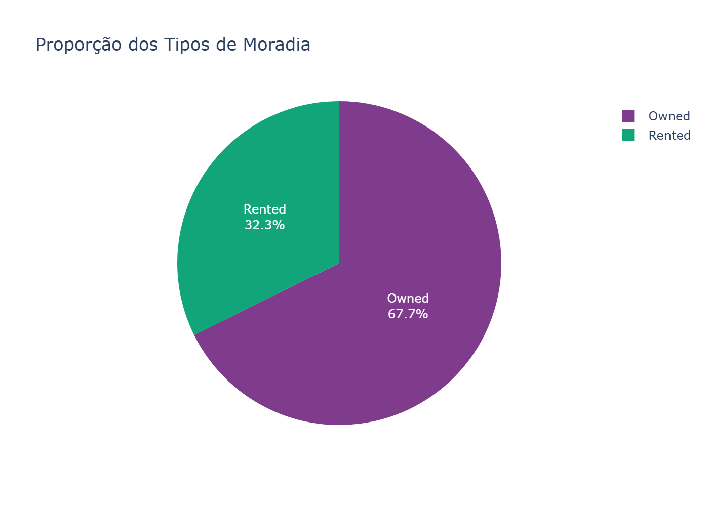

```markdown
- Predominância de casas próprias, reforçando estabilidade financeira.
```

### Densidade de Idade

 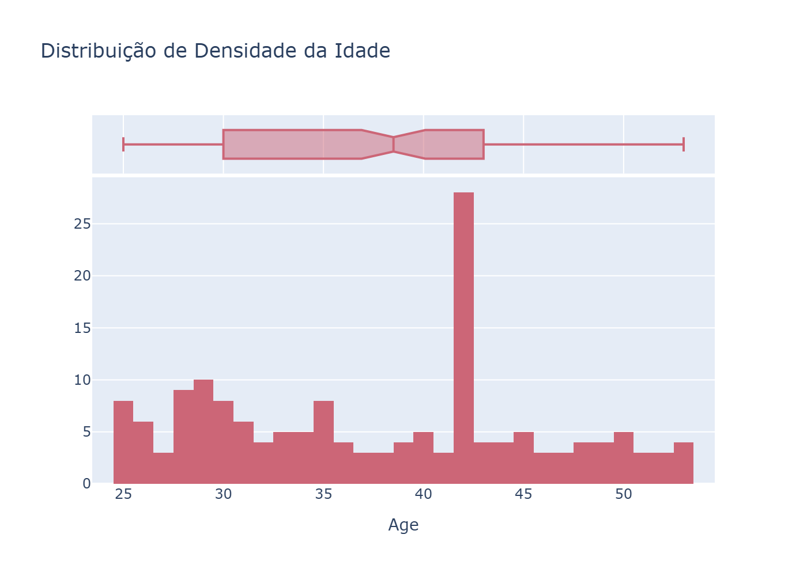

```markdown
- Distribuição simétrica entre 28 e 45 anos, mediana ≈ 36.
- Sem outliers significativos.
```

### Densidade de Renda

 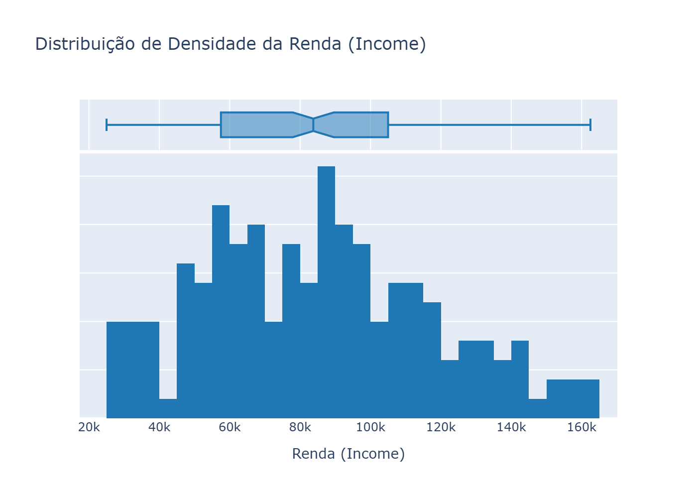

```markdown- Distribuição enviesada à direita (skewed right).
- Renda concentrada entre 40k e 100k, com cauda longa de altos rendimentos.
- Recomendação: normalização ou transformação logarítmica para uso em modelos ML.
```

## Análise Bivariada e Central

### Idade vs. Estado Civil

 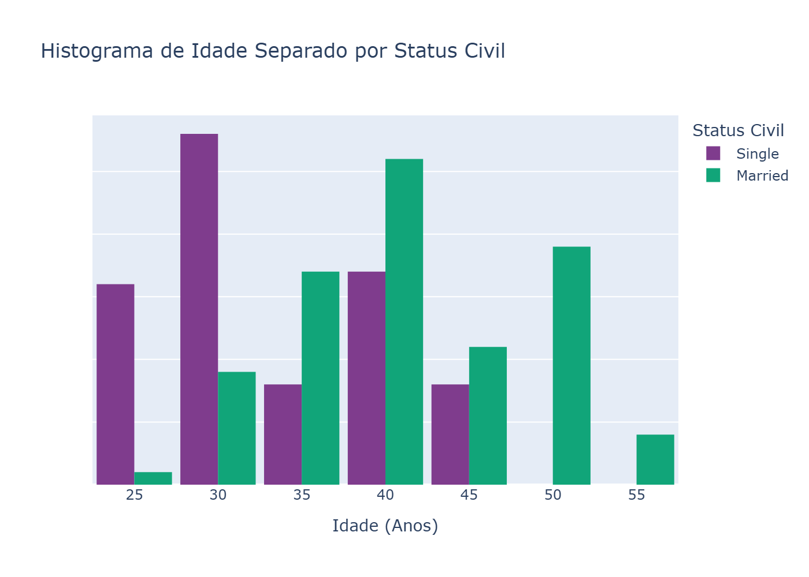

```markdown
- A maior concentração de clientes Single (Solteiro) ocorre nas faixas etárias mais jovens (entre 25 e 40 anos).
- A categoria Married (Casado) mostra uma distribuição mais ampla, com maior frequência nas faixas etárias intermediárias e mais velhas (a partir dos 35 anos).
```

### Nível de Educação vs. Score de Crédito

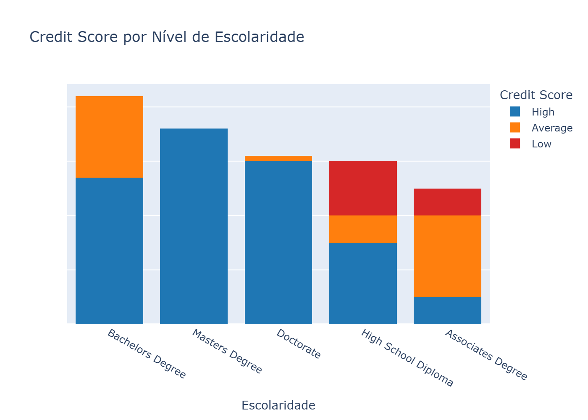

 ```
- O nível de escolaridade "Bachelor's Degree" e "Master's Degree" apresentam o maior volume total de dados.
-  A proporção de Credit Score "High" é significantemente maior nas categorias de maior escolaridade ("Bachelor's Degree", "Master's Degree", "Doctorate").
-  Isto indica uma correlação positiva entre alta escolaridade e melhor pontuação de crédito.
```

### Idade vs. Renda Normalizada

 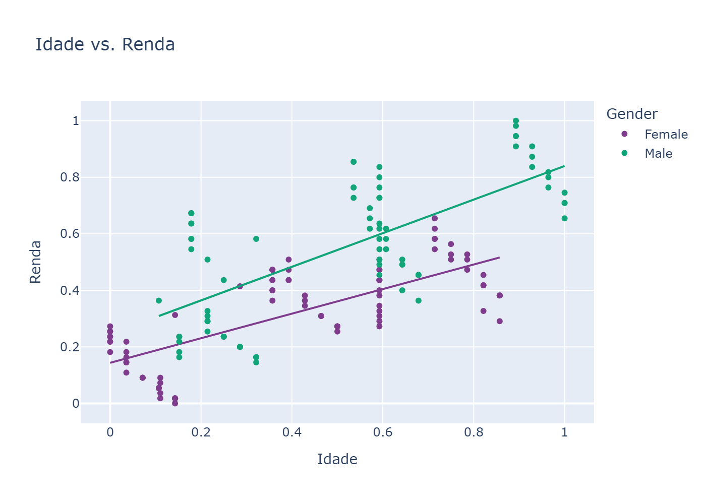

```
- Observa-se uma tendência de aumento da renda (harmonizada/normalizada) com o aumento da idade (normalizada), para ambos os gêneros.
- As mulheres (Female) tendem a apresentar uma renda harmonizada ligeiramente superior aos homens (Male) na mesma faixa de idade normalizada,
conforme indicado pela linha de regressão mais elevada.
```

### Renda vs. Score de Crédito

 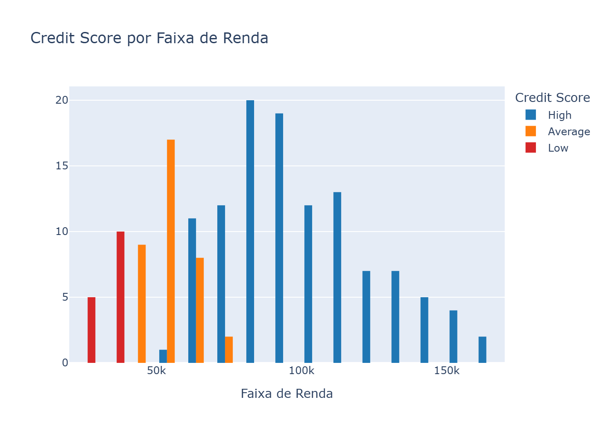

```
- O Credit Score "High" (azul) é predominante nas faixas de renda mais altas (a partir de 0.6 na faixa de renda normalizada).
- Isto indica uma forte correlação positiva entre alta renda e melhor pontuação de crédito.
- Por outro lado, as pontuações "Low" (vermelho) e "Average" (laranja) são mais concentradas nas faixas de renda mais baixas.
```

### Propriedade de Imóvel vs. Score de Crédito

 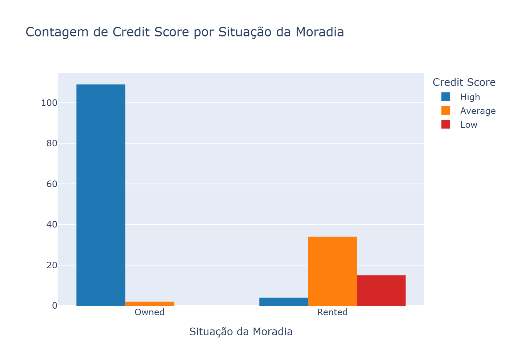


````
- Há uma predominância significativa de pessoas com moradia própria (Owned). 
- A proporção de Credit Score "High" é esmagadora para quem possui casa própria,
enquanto a pontuação "Low" é relativamente mais presente no grupo de moradia alugada (Rented).
````

| Perguntas                                           | Respostas                                          |
| -------------------------------------------------- | -------------------------------------------------- |
| **Existe relação entre a idade e o status civil?** | Sim. Clientes casados tendem a ser mais velhos.    |
| **Qual a relação entre score e escolaridade?**     | Maior escolaridade → score mais alto.              |
| **O salário influencia no score de crédito?**      | Renda maior → tendência a score “High”.            |
| **Clientes com casa própria têm score mais alto?** | Sim. 98,2% dos proprietários possuem score “High”. |


## 3. Análise Adicional e Target

### Crianças vs. Score de Crédito

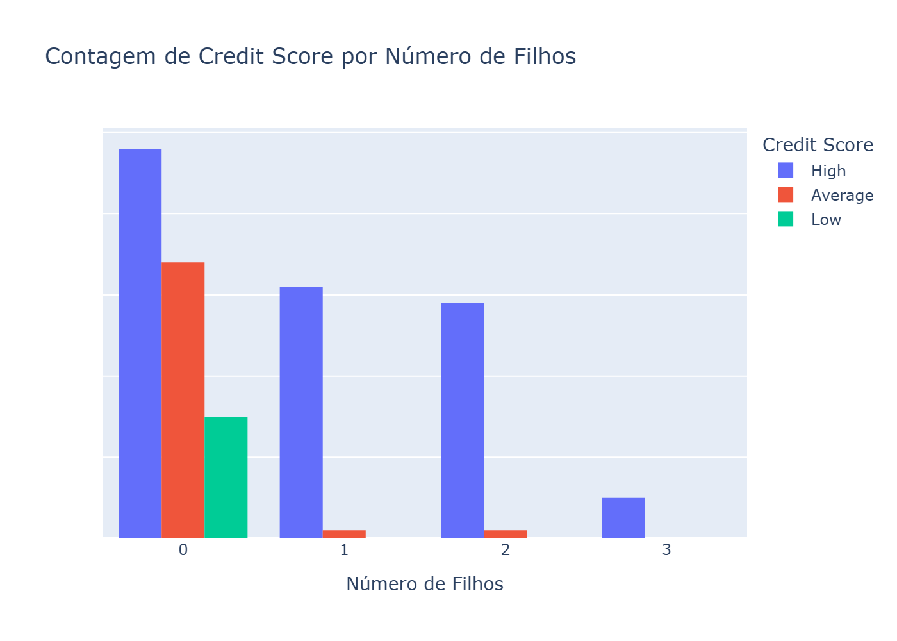

````
- Clientes sem filhos (0) ou com 1 filho representam a maior parte da amostra.
- O Score de Crédito High (Alto) é predominante para clientes com 0 e 1 filho, indicando uma possível correlação negativa entre o número de filhos e a probabilidade de ter um score baixo.
````

### Gênero vs. Score de Crédito

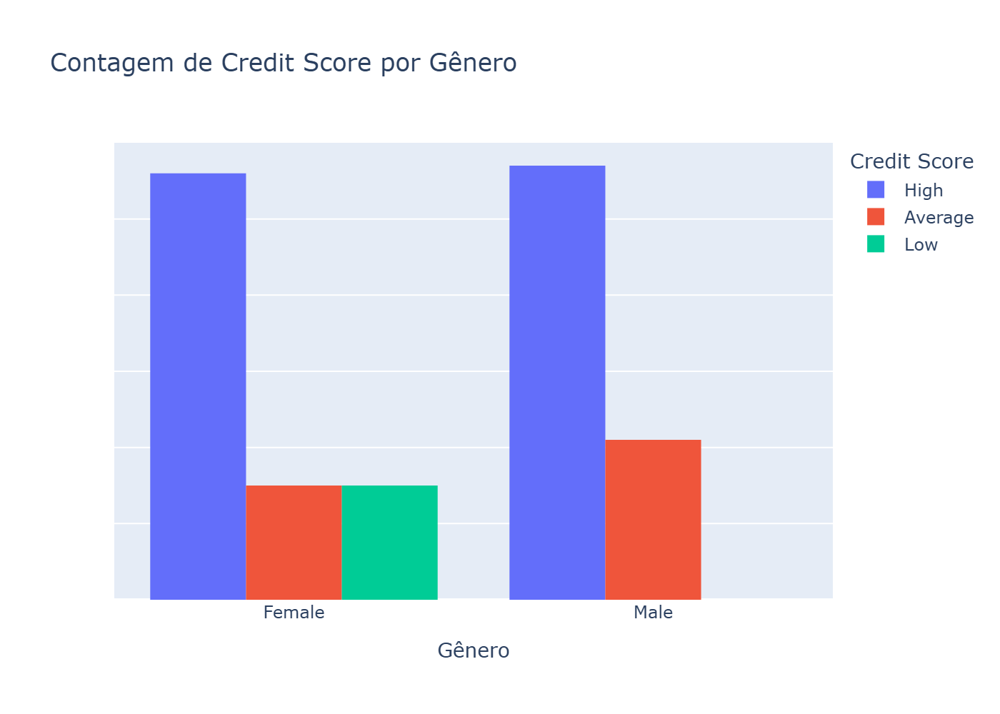

````
- A proporção de clientes por gênero (Masculino e Feminino) é bastante equilibrada na amostra.
- Em ambos os gêneros, o Score de Crédito High (Alto) é a categoria mais frequente.
- Clientes do gênero Masculino parecem ter uma leve vantagem na proporção de Score Alto em comparação com o Feminino.
````

### Estado Civil vs. Score de Crédito

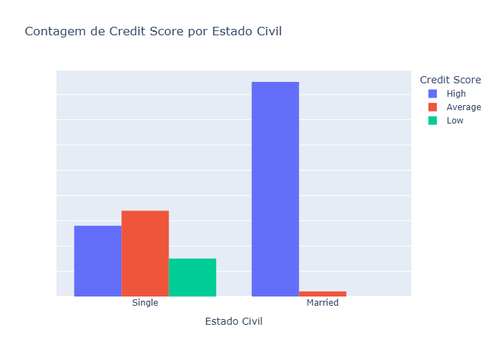

````
- A categoria Married (Casado) tem uma predominância esmagadora de Score de Crédito High (Alto).
- Clientes Single (Solteiro) apresentam uma distribuição mais equilibrada entre as categorias de score, incluindo proporções significativas de scores Average (Médio) e Low (Baixo).
````
---
> [!IMPORTANT]
> Paracer da análise Central e Preditora:
> 
> A base de clientes demonstra um perfil de baixo risco geral e aponta que a estabilidade financeira e doméstica são os preditores mais fortes para um Credit Score "High".


</details>

<details>
<summary><b>Análise Preditora</b></summary>
  
```markdown

- Home Ownership vs. Score:
Insight: Clientes com casa própria ("Owned") são o grupo mais estável, com 98.20% de score "High" e 0% de risco "Low". O grupo "Rented" (Alugados) concentra o maior risco, com aproximadamente 28% de score "Low".
Fluxo: Home Ownership é um preditor poderoso e deve ser codificado (One-Hot) para a modelagem.

- Faixa de Renda (Income_Bins) vs. Score:
Insight: Há uma correlação positiva clara. A faixa de renda mais alta concentra a maioria dos scores "High". As faixas de renda média-baixa têm uma mistura maior de "Average" e "Low" Score, indicando maior risco.
Fluxo: Manter a variável Income para a modelagem. A variável Income_Bins deve ser usada como categórica (Label ou One-Hot).

- Escolaridade vs. Score:
Insight: Grau avançado (Master/Doctorate) se correlaciona com score "High". No entanto, o risco ("Average" e "Low") é mais evidente nos níveis mais baixos de escolaridade (High School Diploma/Associate Degree).
Fluxo: Education é um forte preditor ordinal. Deve ser codificado (Label Encoding) para respeitar a hierarquia dos graus.

- Idade (Age):
Insight: A distribuição da idade é relativamente simétrica e concentrada. O Box Plot sugere que o grupo "Married" tende a ter idades medianas mais altas que o grupo "Single".
Fluxo: Age será usado como preditor linear, mas sua influência deve ser analisada em conjunto com Marital Status e Income.

```
</details>

---

## Etapa 3: Preparação para Modelagem

</details>

<details>
<summary><b>Detalhamento do processo</b></summary>

1. Correlação Inicial: Verificar o Heatmap de correlação entre Age, Income e Number of Children.
Codificação Categórica:

2. One-Hot Encoding para colunas nominais (Gender, Home Ownership, Marital Status).

3. Codificação Ordinal para Education.

4. Correlação Completa: Replotar a correlação para ver o impacto das variáveis codificadas na variável alvo (Credit Score).

5. Divisão: Separar a base em treino e teste (70/30) usando estratificação (stratify=y).

6. Balanceamento: O Credit Score está desbalanceado (predomínio de "High"). Aplicar SMOTE (ou técnica similar) APENAS na base de treino para equalizar as classes de risco ("Low" e "Average").
 
</details>
 


### Balanceamento de Target Combinado

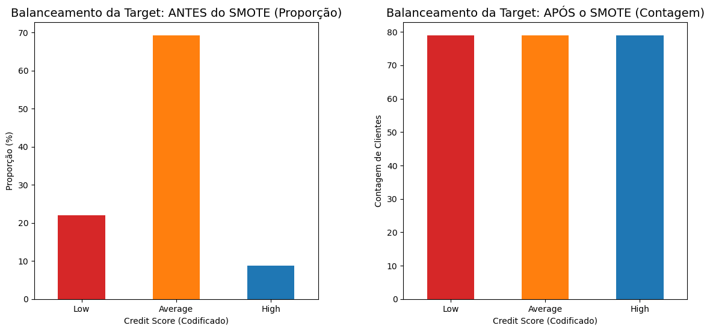

````
- Antes do SMOTE: O target é altamente desbalanceado, com a categoria High (Alto) dominando (Contagem).
- Após o SMOTE: O balanceamento (Proporção) efetivamente equaliza as proporções de todas as categorias de Score
 (Low, Average e High), preparando o conjunto de dados para o treinamento do modelo.
````

### Mapa de Calor de Correlação Inicial

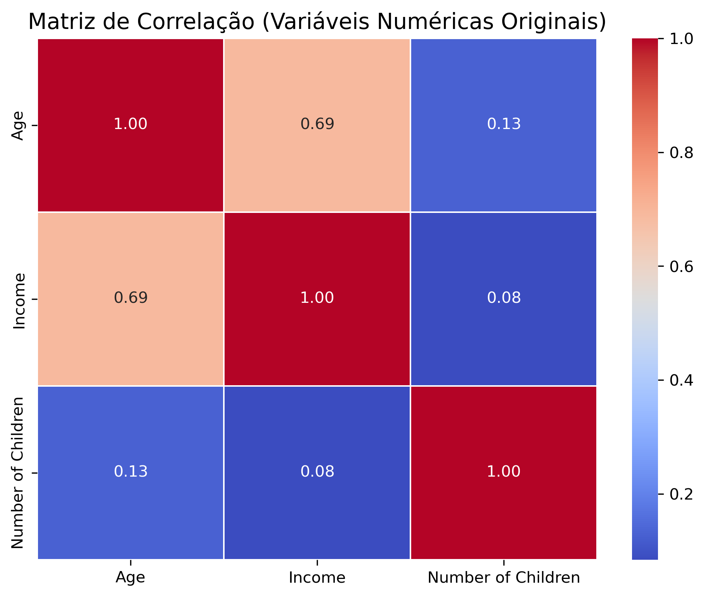

````
- As variáveis numéricas originais (Age, Income e Number of Children) mostram correlações baixas entre si.
- A correlação mais forte é entre Age (Idade) e Income (Renda), com um valor moderado de 0.69,
o que é esperado, pois a renda tende a aumentar com a idade.
-  As correlações envolvendo Number of Children (Número de Filhos) são muito baixas (0.13 com Idade e 0.08 com Renda),
 indicando que esta variável é praticamente independente das outras duas.

````

### Mapa de Calor de Correlação Completa


````
- O Credit Score tem uma correlação positiva moderada com variáveis como Income (Renda) e Education_Encoded (Nível de Educação).
- Existe uma forte correlação negativa entre Credit Score e o Gender_Male (Gênero Masculino), sugerindo uma relação inversa com a variável binária de gênero.
````

> [!TIP]
> **Correlação Numérica**
> 
> A relação entre Age e Income apresentou correlação média-alta (≈ 0.69).
> 
>  Paraecer: o aumento da idade reflete progressão profissional e aumento da renda — padrão esperado em bases financeiras.
> 
>  **Codificação Categórica**
> 
>  One-Hot Encoding: Gender, Home Ownership, Marital Status
>  Label Encoding: Education

### Balanceamento das Classes

A variável Credit Score estava desbalanceada:

* “Average” → ~70%
* “Low” → ~20%
* “High” → ~10%

Foi aplicado **SMOTE** apenas na base de treino para equilibrar as classes.

```python
from imblearn.over_sampling import SMOTE

X_res, y_res = SMOTE(random_state=42).fit_resample(X_train, y_train)
print(Counter(y_res))
```

> 🧠 Resultado: melhor distribuição entre classes, reduzindo viés do modelo e garantindo aprendizado equilibrado.

---

## 🧭 Próximos Passos (Parte 2)

🔹 Construir e treinar modelos de classificação supervisionada:

* Logistic Regression
* Random Forest
* XGBoost

🔹 Avaliar métricas:

* Accuracy, Precision, Recall e F1-score
* Matriz de confusão
* AUC-ROC

🔹 Interpretar a importância das variáveis e gerar **insights preditivos** sobre o comportamento dos clientes.

---

## 💭 Reflexão Final

> O projeto demonstrou que **estabilidade financeira e social** (moradia própria, renda alta e escolaridade) são fatores decisivos na credibilidade de crédito.
> Essa compreensão é essencial para bancos e fintechs que desejam otimizar decisões de concessão de crédito.

---

## Autor


<p align="center">
  <b>Johnny Sorato Martins Fernandes</b><br>
  <sub>Consultoria | Ciência e Análise de Dados| Python - EDA </sub><br><br>
    📧 fernandesjohnnys@gmail.com &nbsp;&nbsp;📞 (66) 99232-1719
</p>

---

## 📦 Instalação dos Requisitos

```bash
pip install -r requirements.txt
```

---

<p align="center">
  <i>“Dados bem tratados contam histórias, revelam padrões e constroem decisões inteligentes.”</i>
</p>
```

---
