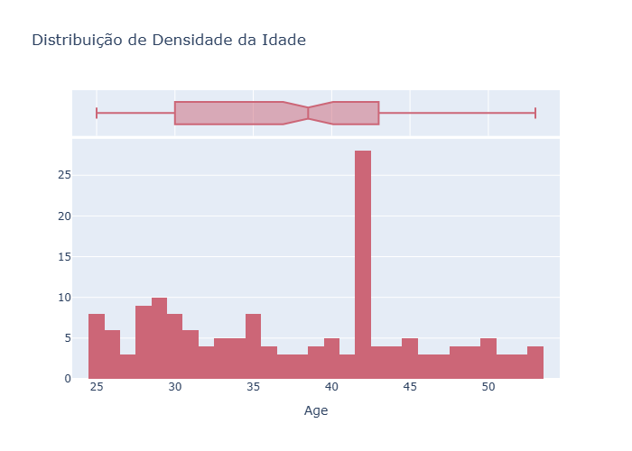

[](https://git.io/typing-svg)

---


<details>

<summary>📚 Sumário</summary>

## Sumário do Projeto

- [🎯 Objetivo](#objetivo)
- [📂 Jornada do Projeto](#jornada-do-projeto)
- [📂 Estrutura do Projeto](#-estrutura-do-projeto)
- [📂 Dicionário de Dados](#-dicionário-de-dados)
- [🧩 Etapa 1 — Pré Processamento](#etapa-1---pré-processamento)
- [📊 Etapa 2 — Análise Univariada e Bivariada](#-etapa-2---análise-univariada-e-bivariada)
- [📈 Etapa 3 — Correlação Balanceamento e Codificação](#-etapa-3---correlação-balanceamento-e-codificação)
- [🧭 Próximos Passos (Parte 2)](#-próximos-passos-parte-2)
- [💭 Reflexão Final](#-reflexão-final)
- [👨‍💻Autor](#autor)
- [📦 Instalação dos Requisitos](#-instalação-dos-requisitos)

</details>

# 🧮 Projeto de Credit Score - P1 

> Projeto Credit Score - Parte 1
Nesta primeira etapa do projeto Credit Score, construímos uma base sólida para compreender o perfil dos clientes e preparar os dados para modelos preditivos de crédito. O foco é criar um pipeline de dados limpo, balanceado e estatisticamente confiável — essencial para análises robustas e machine learning.
> O objetivo é preparar e compreender a base de clientes antes da modelagem, aplicando técnicas de pré-processamento, análise univariada e bivariada, e balanceamento de classes.

---

### Objetivo

> O termo Credit Score refere-se a uma pontuação numérica que indica a credibilidade de um indivíduo em relação ao cumprimento de suas obrigações financeiras — como empréstimos e cartões de crédito.  

> O objetivo deste projeto é prever o risco de inadimplência de clientes com base em atributos demográficos e financeiros, preparando os dados para uma futura modelagem preditiva.

---

### 📂 Estrutura do Projeto 
<details>
<summary><b>Exibir Detalhes</b></summary>
  
```markdown

📁 credit_score_part1/
│
├── data/                         # Base de dados original e tratada
├── img/                          # Gráficos gerados nas análises
├── notebooks/                    # Notebooks de processamento
│   └── credit_score_parte1.ipynb
├── README.md                     # Este arquivo
└── requirements.txt              # Dependências do projeto

````
</details>

### 📂 Jornada do Projeto
<details>
<summary><b>Exibir Detalhes</b></summary>

```markdown
| Etapa                                | Descrição                                                                                                                                                                                                                            |
| -------------------------------------| ---------------------------------------------------------------------------------------------------------------------------------------------------------------------------------------------------------------------------------------- |
| Pré-processamento dos Dados          | Incluiu limpeza, normalização, padronização e verificação de missing values, assegurando consistência e qualidade na base final.                                                                                                       |
| Análise Univariada                   | Exploramos individualmente cada variável, identificando distribuições, outliers e possíveis inconsistências. Essa etapa permitiu entender o comportamento isolado dos atributos e detectar oportunidades de normalização e limpeza.    |
| Análise Bivariada                    | Investigamos as relações entre variáveis e o impacto direto sobre o target (bom ou mau pagador), utilizando gráficos e correlações estatísticas. Essa visão comparativa ajudou a identificar os atributos com maior poder explicativo. |
| Correlação entre Atributos           | Geramos uma matriz de correlação para avaliar multicolinearidades e redundâncias entre variáveis, otimizando a base para modelagem futura e reduzindo ruído informacional.                                                               |
| Tratamento de Atributos Categóricos  | Variáveis qualitativas foram transformadas por meio de Label Encoding e *One-Hot Encoding, garantindo compatibilidade com algoritmos de machine learning.                                                                           |
| Balanceamento de Classes             | Aplicamos técnicas de oversampling e undersampling (via `imbalanced-learn`) para corrigir o desbalanceamento entre bons e maus pagadores — passo essencial para evitar viés nos modelos futuros.                                     |
| Divisão em Base de Treino e Teste    | Finalizamos a preparação dividindo o dataset em bases de treino (80%) e teste (20%), estruturando o pipeline para as próximas fases de modelagem preditiva.                                                                      |
````
</details>

### 📂 Dicionário de Dados

<details>
<summary><b>Exibir Detalhes</b></summary>

```markdown
| Variável              | Descrição                                                                 |
|-----------------------|---------------------------------------------------------------------------|
| Age               | Idade do cliente                                                         |
| Income            | Renda mensal                                                             |
| Gender            | Gênero do cliente                                                        |
| Education         | Nível de escolaridade                                                    |
| Marital           | Estado civil                                                             |
| Number of Children| Quantidade de filhos                                                     |
| Home              | Tipo de residência (alugada ou própria)                                  |
| Credit Score      | Score de crédito (variável-alvo)                                         |

````
</details>


## Etapa 1 - Pré Processamento  

### 🔹 Ações Realizadas  
- Verificação de **tipos de dados** e conversões necessárias.  
- Tratamento de **valores nulos e inconsistentes**, com justificativas documentadas.  
- Identificação e correção de **valores categóricos incorretos**.  

### Observação  
Foi aplicada normalização na variável *Income* (Renda) e *Age*, utilizando `MinMaxScaler`, apenas para adequação de análise bivariada.

```python
from sklearn.preprocessing import MinMaxScaler
scaler = MinMaxScaler()
df[f'{column_age}_Normalized'] = scaler.fit_transform(df[[column_age]])
df[f'{column_income}_Normalized'] = scaler.fit_transform(df[[column_income]])

```

## Etapa 2 - Análise Univariada e Bivariada


### Credit Score (Score de Crédito)


```markdown
* A maioria dos clientes possui score "High", indicando perfil de baixo risco.
* Scores “Average” e “Low” representam menor parcela, exigindo atenção especial na modelagem.
```


### Age (Idade)


 


- Distribuição simétrica entre 28 e 45 anos, mediana ≈ 36.
- Sem outliers significativos.
 

### Home Ownership (Tipo de Moradia)

 


- Predominância de casas próprias, reforçando estabilidade financeira.

### Income (Renda)

  

- Distribuição **enviesada à direita (skewed right)**.
- Renda concentrada entre **40k e 100k**, com cauda longa de altos rendimentos.
- Recomendação: **normalização ou transformação logarítmica** para uso em modelos ML.


### Age vs Marital Status


 
```markdown
* A distribuição de idade no conjunto de dados está centrada principalmente na faixa entre 35 e 45 anos, com o pico na categoria dos 40 anos.
* As extremidades do gráfico (idades mais jovens e mais velhas) possuem menor representatividade.
```
### Education vs Score Credit


- O nível de escolaridade "Bachelor's Degree" e "Master's Degree" apresentam o maior volume total de dados.
-  A proporção de Credit Score "High" é significantemente maior nas categorias de maior escolaridade ("Bachelor's Degree", "Master's Degree", "Doctorate").
-  Isto indica uma correlação positiva entre alta escolaridade e melhor pontuação de crédito.

### Age vs Icome Norm


- Observa-se uma tendência de aumento da renda (harmonizada/normalizada) com o aumento da idade (normalizada), para ambos os gêneros.
- As mulheres (Female) tendem a apresentar uma renda harmonizada ligeiramente superior aos homens (Male) na mesma faixa de idade normalizada, conforme indicado pela linha de regressão mais elevada.

### Income vs Credit Score


 

- O Credit Score "High" (azul) é predominante nas faixas de renda mais altas (a partir de 0.6 na faixa de renda normalizada).
- Isto indica uma forte correlação positiva entre alta renda e melhor pontuação de crédito. Por outro lado, as pontuações "Low" (vermelho) e "Average" (laranja) são mais concentradas nas faixas de renda mais baixas.

### Homeownership vs Score


- Há uma predominância significativa de pessoas com moradia própria (Owned). 
- A proporção de Credit Score "High" é esmagadora para quem possui casa própria, enquanto a pontuação "Low" é relativamente mais presente no grupo de moradia alugada (Rented).


| Perguntas                                           | Respostas                                          |
| -------------------------------------------------- | -------------------------------------------------- |
| **Existe relação entre a idade e o status civil?** | Sim. Clientes casados tendem a ser mais velhos.    |
| **Qual a relação entre score e escolaridade?**     | Maior escolaridade → score mais alto.              |
| **O salário influencia no score de crédito?**      | Renda maior → tendência a score “High”.            |
| **Clientes com casa própria têm score mais alto?** | Sim. 98,2% dos proprietários possuem score “High”. |


## Insight

> [!TIP]
> Análise Univariada
> Credit Score (Pontuação de Crédito): Insight: A base de clientes é majoritariamente de baixo risco, com a maior parte dos registros concentrada no score "High". Os scores "Average" e "Low" representam uma fatia menor, indicando que o foco da análise deve ser na diferenciação dos scores "High" e "Average".
>
>Age (Idade) Insight: A idade tem uma distribuição simétrica e relativamente concentrada (sem outliers visíveis, conforme a caixa), com a maioria dos clientes entre 28 e 45 anos (aproximadamente Q1 e Q3). A mediana está em torno de 36 anos.
>
> Home Ownership (Situação da Moradia) Insight: A maioria dos clientes tem casa própria ("Owned"), superando significativamente aqueles que alugam ("Rented"). Esta é uma característica de estabilidade na base, que se alinha à alta frequência de score "High".
>
> Income (Renda/Salário) Gráfico: Histograma de Densidade com Box Plot. Insight Curto: A distribuição da Renda é enviesada positivamente (skewed right). A maioria dos clientes tem renda concentrada entre 40k e 100k, mas há uma longa cauda de alta renda se estendendo além de 160k, o que está visível tanto no histograma quanto na extensão do Box Plot superior. Recomendação: O enviesamento e os outliers na cauda superior justificam a normalização da renda para uso em modelos de Machine Learning (o que você já fez com o MinMaxScaler).

ANÁLISE CENTRAL E COMENTÁRIOS DOS GRÁFICOS
> [!TIP]
> A base de clientes demonstra um perfil de baixo risco geral e aponta que a estabilidade financeira e doméstica são os preditores mais fortes para um Credit Score "High".

</details>

<details>
<summary><b>Análise Preditora</b></summary>
  
```markdown

- Home Ownership vs. Score:
Insight: Clientes com casa própria ("Owned") são o grupo mais estável, com 98.20% de score "High" e 0% de risco "Low". O grupo "Rented" (Alugados) concentra o maior risco, com aproximadamente 28% de score "Low".
Fluxo: Home Ownership é um preditor poderoso e deve ser codificado (One-Hot) para a modelagem.

- Faixa de Renda (Income_Bins) vs. Score:
Insight: Há uma correlação positiva clara. A faixa de renda mais alta concentra a maioria dos scores "High". As faixas de renda média-baixa têm uma mistura maior de "Average" e "Low" Score, indicando maior risco.
Fluxo: Manter a variável Income para a modelagem. A variável Income_Bins deve ser usada como categórica (Label ou One-Hot).

- Escolaridade vs. Score:
Insight: Grau avançado (Master/Doctorate) se correlaciona com score "High". No entanto, o risco ("Average" e "Low") é mais evidente nos níveis mais baixos de escolaridade (High School Diploma/Associate Degree).
Fluxo: Education é um forte preditor ordinal. Deve ser codificado (Label Encoding) para respeitar a hierarquia dos graus.

- Idade (Age):
Insight: A distribuição da idade é relativamente simétrica e concentrada. O Box Plot sugere que o grupo "Married" tende a ter idades medianas mais altas que o grupo "Single".
Fluxo: Age será usado como preditor linear, mas sua influência deve ser analisada em conjunto com Marital Status e Income.

```
</details>

### Conclusão da Etapa

> A estabilidade financeira e doméstica (renda e moradia própria) são os *principais preditores de baixo risco*.


## Etapa 3: Preparação para Modelagem

</details>

<details>
<summary><b>Detalhamento do processo</b></summary>

1. Correlação Inicial: Verificar o Heatmap de correlação entre Age, Income e Number of Children.
Codificação Categórica:

2. One-Hot Encoding para colunas nominais (Gender, Home Ownership, Marital Status).

3. Codificação Ordinal para Education.

4. Correlação Completa: Replotar a correlação para ver o impacto das variáveis codificadas na variável alvo (Credit Score).

5. Divisão: Separar a base em treino e teste (70/30) usando estratificação (stratify=y).

6. Balanceamento: O Credit Score está desbalanceado (predomínio de "High"). Aplicar SMOTE (ou técnica similar) APENAS na base de treino para equalizar as classes de risco ("Low" e "Average").
 
</details>
 


---

## 📈 Etapa 3 - Correlação, Balanceamento e Codificação

### Correlação Numérica

A relação entre **Age** e **Income** apresentou correlação média-alta (≈ 0.69).

> 💬 Justificativa: o aumento da idade reflete progressão profissional e aumento da renda — padrão esperado em bases financeiras.

### Codificação Categórica

* **One-Hot Encoding:** Gender, Home Ownership, Marital Status
* **Label Encoding:** Education

### Balanceamento das Classes

A variável *Credit Score* estava **desbalanceada**:

* “Average” → ~70%
* “Low” → ~20%
* “High” → ~10%

Foi aplicado **SMOTE** apenas na base de treino para equilibrar as classes.

```python
from imblearn.over_sampling import SMOTE

X_res, y_res = SMOTE(random_state=42).fit_resample(X_train, y_train)
print(Counter(y_res))
```

> 🧠 Resultado: melhor distribuição entre classes, reduzindo viés do modelo e garantindo aprendizado equilibrado.

---

## 🧭 Próximos Passos (Parte 2)

🔹 Construir e treinar modelos de classificação supervisionada:

* Logistic Regression
* Random Forest
* XGBoost

🔹 Avaliar métricas:

* Accuracy, Precision, Recall e F1-score
* Matriz de confusão
* AUC-ROC

🔹 Interpretar a importância das variáveis e gerar **insights preditivos** sobre o comportamento dos clientes.

---

## 💭 Reflexão Final

> O projeto demonstrou que **estabilidade financeira e social** (moradia própria, renda alta e escolaridade) são fatores decisivos na credibilidade de crédito.
> Essa compreensão é essencial para bancos e fintechs que desejam otimizar decisões de concessão de crédito.

---

## Autor


<p align="center">
  <b>Johnny Sorato Martins Fernandes</b><br>
  <sub>Consultoria de Negócios | Cientista de Dados| Analista de Dados - Automação de Processos - SaaS</sub><br><br>
  <sub> JS Fernandes Consultoria Empresarial - Unidade Primavera do Leste</sub><br><br>
  📧 fernandesjohnnys@gmail.com &nbsp;&nbsp;📞 (66) 99232-1719
</p>

---

## 📦 Instalação dos Requisitos

```bash
pip install -r requirements.txt
```

---

<p align="center">
  <i>“Dados bem tratados contam histórias, revelam padrões e constroem decisões inteligentes.”</i>
</p>
```

---
